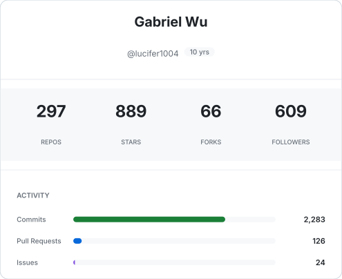
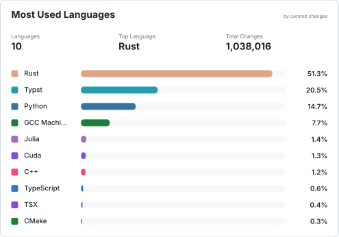
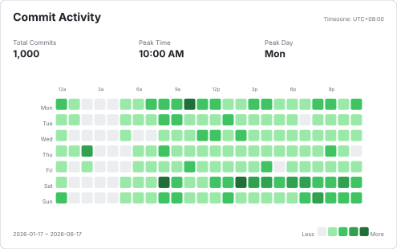

# Hey, lucifer1004 here! :wave:

<table>
<tr>
<td valign="top" width="50%">

Hi, I'm Gabriel Wu. I received my Bachelor's degree in Physics and Ph.D. degree in Cartography & GIS from Peking University.

Currently, I am a software engineer at DevTech, NVIDIA.

- :hammer_and_pick: Rust / Typst / C++ / Python / TypeScript
- :fire: Building [govctl](https://github.com/govctl-org/govctl) & [skillc](https://github.com/govctl-org/skillc) for governed AI coding
- :art: Contributing to Typst Universe: [citrus](https://github.com/pku-typst/citeproc-typst), [modern-pku-thesis](https://github.com/pku-typst/pkuthss-typst), [leetcode-livebook](https://github.com/lucifer1004/leetcode.typ)
- :rocket: Contributing to [tilelang](https://github.com/tile-ai/tilelang) & [LFortran](https://github.com/lfortran/lfortran)
- :sunny: Maintaining [govctl-org](https://govctl.org) and [CP-Wiki](https://cp-wiki.vercel.app)
- :man: Pronouns: he/him

</td>
<td width="50%">



</td>
</tr>
</table>

<p align="center">
  
</p>

<p align="center">
  
</p>

## Wakatime statistics

<!--START_SECTION:waka-->

```txt
Markdown      11 hrs 22 mins        ████████████▓░░░░░░░░░░░░   50.20 %
Typst         4 hrs 23 mins         █████░░░░░░░░░░░░░░░░░░░░   19.38 %
Other         2 hrs 57 mins         ███▒░░░░░░░░░░░░░░░░░░░░░   13.07 %
Julia         1 hr 52 mins          ██░░░░░░░░░░░░░░░░░░░░░░░   08.29 %
TOML          31 mins               ▓░░░░░░░░░░░░░░░░░░░░░░░░   02.29 %
```

<!--END_SECTION:waka-->
